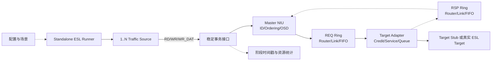

# AI Core Ring-Lite 与 GPGPU-Sim 互连对比及需求收敛方案

| 项目 | 内容 |
| --- | --- |
| 文档状态 | 架构对比与收敛基线，待专家评审 |
| 对比对象 | `BUS/aicore/tm_ring_*`、GPGPU-Sim `LOCAL_XBAR`、GPGPU-Sim `INTERSIM/Intersim2` |
| 评审目标 | 多 Core 独立 ESL、延迟/交织/瓶颈/OSD 可配置、约 80% 性能精度目标 |
| 结论 | 有条件通过：保留事务/分段级 Ring-Lite 主线，选择性吸收 GPGPU-Sim 的接口、仲裁、缓冲、统计和校准方法；不直接嵌入完整 Intersim2 |

## 1. 结论先行

当前 AI Core Ring-Lite 的抽象层级总体适合这三项需求。它已经具备多 Master/多 Target、独立请求与响应子网、双向多跳路径、链路传播延迟、按包长计算的序列化、有限 FIFO/inflight、线性与 XOR 交织、Master/Global/Target 多级并发约束，以及可脱离完整 SoC 调用的 Fabric API 和 demo 骨架。相比 GPGPU-Sim 的 `LOCAL_XBAR`，当前模型更能表达拓扑路径和链路热点；相比 `INTERSIM/Intersim2`，它的状态量和校准成本显著更低，更符合 ESL 约 80% 性能精度目标的成本边界。

当前版本仍不能宣称已经满足三项需求。首要问题不是缺少完整 flit/VC NoC，而是独立运行入口、真实输出仲裁、OSD 生命周期、延迟语义、按资源统计和精度闭环尚未完全收敛。尤其需要注意：demo 中的 `performance_target_pct=80` 目前表示“实测带宽相对粗估峰值的利用率”，不是相对 RTL、硅数据或高保真模型的性能精度，不能用于第 3 项验收。

建议保留 `TmRingFabric` 作为 V1 传输平面，同时优先借鉴 GPGPU-Sim 的五项机制：稳定且与后端解耦的互连接口；按输出端口实施的 RR/iSLIP 风格仲裁；请求/响应独立子网与有限边界缓冲；事务阶段时间戳和分层统计；地址映射与流量场景可配置。完整的 flit、Virtual Channel（VC）、VC allocator 和 switch allocator 只在对标证明确有必要时进入后续版本。

## 2. 证据边界

本文把输入划分为四类，避免将代码现状误写成最终规格。

| 类型 | 内容 |
| --- | --- |
| 已知需求 | 多 Core；不依赖完整 SoC 即可运行 ESL；延迟、交织和关键路径 OSD 可配；能够复现关键瓶颈；性能精度目标约 80% |
| 代码观察 | Ring-Lite 已实现多 Master/Target、REQ/RSP 子网、逐跳 Link、有限队列、线性/XOR 交织、分层 OSD/credit/token 和 demo 统计 |
| 设计决策 | V1 继续使用事务/协议段级双向 Ring；新增稳定的独立运行接口、输出端仲裁、阶段统计和校准闭环 |
| 待确认事项 | 最终物理拓扑、Router 流水级数、真实仲裁/QoS、OSD 申请释放点、Target 服务曲线、对标数据源和验收权重 |

代码观察来自以下入口：

- AI Core：[tm_ring.h](../aicore/tm_ring.h)、[tm_ring_core.cc](../aicore/tm_ring_core.cc)、[tm_ring_router.cc](../aicore/tm_ring_router.cc)、[tm_ring_link.cc](../aicore/tm_ring_link.cc)、[tm_ring_topology.cc](../aicore/tm_ring_topology.cc)、[tm_bus_flow_ctrl.cc](../aicore/tm_bus_flow_ctrl.cc) 和 [tm_ring_demo_test.h](../aicore/tm_ring_demo_test.h)。
- GPGPU-Sim：[icnt_wrapper.h](</C:/Users/wayne/Downloads/gpgpu-sim_distribution-dev/src/gpgpu-sim/icnt_wrapper.h>)、[icnt_wrapper.cc](</C:/Users/wayne/Downloads/gpgpu-sim_distribution-dev/src/gpgpu-sim/icnt_wrapper.cc>)、[local_interconnect.h](</C:/Users/wayne/Downloads/gpgpu-sim_distribution-dev/src/gpgpu-sim/local_interconnect.h>)、[local_interconnect.cc](</C:/Users/wayne/Downloads/gpgpu-sim_distribution-dev/src/gpgpu-sim/local_interconnect.cc>)、[interconnect_interface.cpp](</C:/Users/wayne/Downloads/gpgpu-sim_distribution-dev/src/intersim2/interconnect_interface.cpp>)、[gputrafficmanager.cpp](</C:/Users/wayne/Downloads/gpgpu-sim_distribution-dev/src/intersim2/gputrafficmanager.cpp>) 和 [addrdec.cc](</C:/Users/wayne/Downloads/gpgpu-sim_distribution-dev/src/gpgpu-sim/addrdec.cc>)。

## 3. 需求工程化与当前差距

| 编号 | 工程要求 | 设计响应 | 当前状态 | 验证方法 |
| --- | --- | --- | --- | --- |
| R1 | 1～N 个 Core/Master 可动态创建并并发注入；不实例化 SoC、CPU、缓存一致性或系统软件即可构造、运行、排空用例 | 提供稳定的 `create/can_accept/push/pop/tick/busy/stats` 独立接口；自带流量源和可配置 Target Stub | 部分满足。Fabric API 和多 Master demo 已存在，但缺少独立构建目标、固定配置契约和自动回归入口 | 在空白进程中只链接总线模型，运行 1/2/4/8 Master 的读、写、混合和排空用例；不得引用 SoC 顶层对象 |
| R2.1 | 固定延迟、仲裁等待、队列等待、链路序列化、跳数、Target 服务和响应返回分别可观察 | 保留 Link 流水模型；补 Router 固定延迟和阶段时间戳；禁止将传播延迟当成非流水占用 | 部分满足。Link 延迟/序列化已实现，Router 固定延迟和完整阶段拆分不足 | 单 Master、无拥塞、不同跳数扫描；延迟斜率应与每跳参数一致，宽度变化不得改变纯传播周期 |
| R2.2 | 地址交织策略和粒度可配置，并能形成均匀分布或热点 | 保留 NONE/LINEAR/XOR；扩展位选/掩码映射；输出每 Target 请求/字节分布 | 基本满足。当前支持线性和 XOR，但配置审计及分布统计不足 | 固定 trace 下扫描交织粒度/哈希；总请求字节不变，Target 分布按预期改变 |
| R2.3 | 多 Core 必须竞争同一受限输出、Link 或 Target；不存在绕过共享瓶颈的路径 | Router 改为输出端集中仲裁；Link/Target 保持有限资源和逐级反压 | 未完全满足。当前输出 winner 仍可能受事件执行顺序影响 | 同拍让多个输入争同一输出，检查每拍最多一个 winner、RR/iSLIP 序列、公平性和无饥饿 |
| R2.4 | Master、Global、Target 等关键路径 OSD 可配置，且申请/释放点明确 | 分别定义资源所有者和生命周期；加入占用积分、峰值、阻塞周期和不变量 | 部分满足。参数已存在，但 Global/Target OSD 当前在 Target 发射附近申请，语义与“全路径 OSD”尚未冻结 | 扫描 OSD=1/2/4/...；检查带宽时延积拐点、计数不下溢、排空归零、终态响应后释放 |
| R2.5 | 能定位主瓶颈，而非只显示总带宽下降 | 每 Link/方向/子网、Router 输出、Target 和 OSD 资源分别统计利用率、队列和等待；用放宽实验确认瓶颈 | 部分满足。已有聚合 stall，但资源粒度和证据链不足 | 对候选资源做单变量放宽；只有“接近饱和、上游等待增长、放宽后 KPI 改善”同时成立才判定主瓶颈 |
| R3 | 以独立参考数据验证约 80% 性能精度，校准集与验收集隔离 | 建立 RTL/硅/高保真平台对标、误差预算、参数冻结和留出集 | 未满足。当前 80% 是利用率目标，不是精度 | 功能不变量 100%；至少 80% 验收场景吞吐误差≤15%，至少 80% 场景 P50/P95 延迟误差≤20%，瓶颈分类正确率≥80% |

## 4. 两套互连的结构对比

### 4.1 AI Core Ring-Lite

AI Core 当前采用消息/协议段级双向 Ring。每个 Master 和 Target 映射到 ring stop，请求和响应使用独立子网，按最短方向逐跳传输。Link 以固定传播延迟、字节宽度、包序列化周期、FIFO 和最大 inflight 限制吞吐；Target 侧以 slot credit、带宽 token 和本地请求队列表达服务能力；Master 侧保留读写 OSD 和完整的两阶段写事务语义。

该方案的优势是保留了端点位置、路径重叠、方向竞争、热点最小割和回程压力。其主要精度边界是包级仲裁，不能自然复现 flit 交错、VC 级队头阻塞和 Router 微流水竞争。

### 4.2 GPGPU-Sim LOCAL_XBAR

`LOCAL_XBAR` 把 shader 与 memory node 视为端点，默认建立请求和回复两个 subnet。每个 subnet 有显式输入/输出队列，支持朴素 RR 和 iSLIP 仲裁，并记录 conflict、buffer full、队列平均占用和有效周期吞吐。其 `CreateInterconnect/HasBuffer/Push/Pop/Advance/Busy` 接口非常适合独立仿真和后端替换。

它并不是可直接满足本需求的精确总线模型。实现明确假设所有 packet 都是一个 flit，`size` 不参与缓冲占用和传输时间；没有可配置链路宽度、多跳传播延迟或 Target 协议语义。因此应借其接口、仲裁和统计组织，不应复制其单 flit 时间模型。

### 4.3 GPGPU-Sim INTERSIM/Intersim2

`INTERSIM` 通过相同 wrapper 接入 BookSim 风格网络。packet 按 `flit_size` 切分，网络包含拓扑、路由、VC、Router buffer、credit、各级 allocator 和边界/ejection buffer，并记录 packet latency、network latency、fragmentation 等时间。它适合研究细粒度 NoC 拥塞和 VC 行为。

其代价是参数数量、状态量、运行时间、死锁义务和校准成本都显著增加。若没有真实 flit size、VC 数量、Router pipeline、buffer 深度和 routing 参数，直接集成只会得到更复杂但不更可信的模型。因此 Intersim2 应作为机制参考和必要时的高保真对照，不作为 V1 运行后端。

### 4.4 对比矩阵

| 维度 | AI Core Ring-Lite | GPGPU-Sim LOCAL_XBAR | GPGPU-Sim INTERSIM | 结论 |
| --- | --- | --- | --- | --- |
| 抽象粒度 | 事务/协议段级 | 单 flit packet 级 | flit/VC/Router 级 | V1 保持 Ring-Lite |
| 多 Core 端点 | 配置化 Master/Target | `n_shader/n_mem` 动态创建 | 动态端点映射到网络节点 | 借鉴统一创建接口和端点映射审计 |
| 拓扑 | 双向多跳 Ring | 单级 Crossbar | Mesh/Fly/多种 NoC | Ring 更适合当前路径与热点需求；保留 XBar 参照模型 |
| 请求/响应隔离 | 两个逻辑 subnet | 两个 subnet | 可配多个 subnet | 已具备，补充独立统计和容量配置 |
| 仲裁 | 输入侧扫描，输出 RR 状态未真正参与 winner 选择 | RR/iSLIP 按输出匹配 | VC/switch allocator | P0 引入输出端仲裁；不需完整 allocator |
| 延迟 | Link 传播、序列化、接口与 Target 参数 | 无显式传输延迟/宽度 | 逐级 Router/Link 延迟 | 借 Intersim 阶段拆分，不照搬全部微结构 |
| 缓冲与反压 | NIU/Router 接口、Link、Target 有限资源 | 输入/输出 buffer | VC、ejection、boundary buffer 与 credit | 补每级占用与阻塞传播统计 |
| 交织 | NONE/LINEAR/XOR | 互连自身不做地址交织 | 互连节点映射，不等价于内存交织 | 借 `addrdec` 的位选/掩码/IPOLY 思路，不混入 Router |
| OSD | Master/Global/Target 参数存在 | 无端到端事务 OSD | 主要是网络 buffer/credit | 保留 AI Core 事务 OSD，冻结生命周期 |
| 协议语义 | RD、WR、WR_DAT、多响应 | `void*` packet，无两阶段写 | flit 仅承载上层指针 | 绝不能用网络层替代协议层 |
| 统计 | 总吞吐/平均延迟/公平性/聚合 stall | conflict/buffer/utilization | packet/network/fragmentation/VC | 借鉴分阶段和分资源统计 |
| 独立运行 | API/demo 已有，工程入口不完整 | wrapper 很清晰 | wrapper 很清晰 | P0 形成稳定 Runner 与后端接口 |
| 校准成本 | 中 | 低，但精度上限低 | 高 | Ring-Lite 最符合约 80% 精度的成本收益 |

## 5. 建议借鉴的机制

### 5.1 P0：稳定的独立互连接口

参照 GPGPU-Sim wrapper，将 SoC 适配器与互连模型解耦。逻辑接口建议固定为：

```text
create(num_masters, num_targets, config)
can_accept(master, command, bytes)
push(master, transaction)
can_receive(master)
pop(master)
tick(cycles=1)
busy()
drain()
stats()
```

接口必须以事务字节数和 Traffic Class 做准入，而不是只检查“是否还有一个 packet 空位”。独立 Runner 负责解析配置、生成流量、挂接 Target Stub、推进时钟、排空网络和导出结果；SoC 环境只需要提供另一种 endpoint adapter。这样同一 Fabric 可在独立 ESL、SoC 集成和回归测试中复用。



### 5.2 P0：真正的输出端仲裁

GPGPU-Sim `LOCAL_XBAR` 最值得借鉴的是“先按输出收集 request，再由每个输出选择 winner”的组织。当前 Router 由 LOCAL/EAST/WEST 输入各自触发推进，`output_rr_ptr_` 在 commit 时更新，却没有参与候选 winner 的选择。同一仿真拍多个输入争同一 Link 时，首个执行的 callback 可能先占用 Link，结果会依赖事件调度顺序。

建议 Router 每拍执行以下原子过程：收集全部输入头部候选；按 `(subnet, output_port)` 分组；应用可配置仲裁；检查下游容量；每个物理输出最多提交一个 winner；只对成功提交的 winner 推进 RR 指针。V1 至少支持 `ROUND_ROBIN` 和 `WEIGHTED_RR`，iSLIP 可作为多个输入/多个输出同时匹配时的候选策略。必须统计 request 数、grant 数、仲裁失败等待、最大连续等待和每 Master 服务份额。

### 5.3 P0：阶段时间戳与资源级瓶颈统计

借鉴 Intersim2 的 creation/injection/arrival 等时间戳，但使用符合 AI Core 事务语义的阶段：`accepted`、`niu_enqueued`、`ring_injected`、每跳 `router_grant/link_enter/link_exit`、`target_enqueued`、`target_accepted`、`first_response`、`last_response`、`master_completed`。由相邻时间戳计算源端等待、仲裁、队列、传播、序列化、Target 和回程时间，避免把所有延迟合并成一个数。

统计必须按 `Master × Target × Traffic Class`、`Link × Direction × Subnet` 和 `Router × Output` 导出。至少包括包/字节、busy cycle、队列占用积分/峰值、wait cycle、grant、full、inflight、OSD 占用积分/峰值、Target service、P50/P90/P95/P99 延迟和 Jain 公平性。每个未成功动作每拍只登记一个主阻塞原因，防止同一停顿被多次计数。

还应借鉴 Intersim2 的无进展监测。有限 FIFO 和环形依赖可能形成循环反压；在没有 VC/escape channel 的前提下，必须通过 bubble/injection 约束、可证明的容量规则或其他无死锁机制保证至少一个 packet 能继续前进。Runner 需要配置 `no_progress_timeout`，超时后导出每个输入头部、目标输出、占用和阻塞原因并判失败，不能把死锁误报为“高拥塞”。

### 5.4 P0：地址映射与配置审计

当前 LINEAR/XOR 足够形成第一版均匀和热点场景。可借鉴 GPGPU-Sim `addrdec` 的位选/掩码描述，增加 `BIT_SELECT` 或通用 mask mapping，以复现 channel/bank 位布局；IPOLY 等复杂哈希只在真实平台使用时实现。地址译码保持在 Topology/AddressMap，不进入 Router。

模型启动时必须打印最终配置、来源、消费者和配置指纹。审计规则至少包括：Target 地址范围不重叠或明确优先级；交织粒度满足对齐；slice 数与 Target 集合一致；位宽/FIFO/OSD 非零；端点 ID 唯一；所有配置项至少被一个运行模块消费。

### 5.5 P1：轻量分段与 Traffic Class

若对标显示长读响应阻塞短控制包是主要误差，可把 packet 拆成固定大小 segment/beat，并允许不同事务在 packet 边界或 segment 边界交错。该扩展可借鉴 Intersim2 的 packet-to-flit 关系，但不立即引入 VC allocator。请求、写数据和响应应继续使用独立 Traffic Class，并允许配置优先级或权重。

### 5.6 P2：仅按证据引入 VC/flit NoC

只有当留出集误差明确来自 VC 级 HOL blocking、credit 往返或 Router 微流水，并且这些参数能够从 RTL/设计规格获得时，才引入轻量 VC 或接入 Intersim2 作为高保真后端。每次升级都必须证明误差改善大于运行时和校准成本。

## 6. 不应照搬的机制

`LOCAL_XBAR` 的 `size` 参数没有决定 buffer 占用或传输周期，所有 packet 被视为一个 flit，因此不能拿来验证总线位宽、长短包混合和序列化。它的统计值得借鉴，时间模型不适合作为当前主线。

Intersim2 的 flit、VC、credit 和 allocator 不应整体嵌入 V1。AI Core 的两阶段写、多响应完成、Master/Target OSD、地址交织和 Target 服务语义仍必须由事务层定义；网络只能传送并阻塞事务，不能替代协议状态机。

GPGPU-Sim 的 shader/memory 端点编号和网络节点映射不应直接成为 AI Core 地址路由规则。AI Core 需要稳定的 Master ID、Target ID、Transaction ID、Traffic Class 和 Ordering Domain，节点位置只是拓扑配置。

## 7. 性能模型收敛

### 7.1 延迟分解

端到端读延迟建议按下式记账：

```text
Tread = Tsource_wait + Tniu_req
      + Σ(Trouter_pipe + Tarb_wait + Tlink_prop)req
      + Ttarget_queue + Ttarget_service
      + Σ(Trouter_pipe + Tarb_wait + Tlink_prop)rsp
      + Tniu_rsp
```

链路序列化周期为 `ceil(packet_bytes / link_width_bytes)`，它决定同一方向子网的下一次可发送时间；传播延迟决定已经进入链路的 packet 何时到达。二者可以流水重叠，不能简单相加成链路不可用时间。Router 固定流水延迟与仲裁等待也必须分开。

当前 Target 的 `frontend_latency + forward_latency + header_latency + payload_cycles + hotspot_penalty` 被用于设置下一次发射时间，实际上更接近“非流水服务间隔”，并不等价于每笔事务固定延迟。后续应拆为 `target_accept_interval`、`target_fixed_latency` 和 `target_payload_width`；热点应主要由有限队列、服务间隔和竞争自然形成，`hotspot_penalty` 只作为有依据的经验项，并计入独立误差预算。

### 7.2 带宽上界

稳定流量下，有效带宽满足：

```text
BWeffective <= min(
  BWsource_injection,
  BWring_min_cut,
  BWtarget_service,
  BWrsp_min_cut,
  OSD * average_payload / average_RTT
)
```

其中 `BWring_min_cut` 必须按实际流量矩阵统计经过每条 Link 的字节量，不能用 `min(num_masters, num_targets) × min(link_width, target_width)` 代替。OSD 近似只适用于稳定流量、事务大小明确、完成条件明确且没有额外顺序阻塞的场景。

### 7.3 OSD 生命周期

| 资源 | 建议申请点 | 阻塞点 | 建议释放点 |
| --- | --- | --- | --- |
| Master Read OSD | 模型接受读事务时 | Master ingress | 最后一个预期读响应被 Master 接受 |
| Master Write OSD | 模型接受写事务时 | Master ingress | 写终态响应被 Master 接受 |
| Global OSD | 事务进入 Fabric 时 | 网络注入前 | 事务终态响应完成 |
| Target Read/Write Slot | 地址译码后、进入 Target 受控域前 | Target ingress | Target 真实资源结束；多响应事务需由协议/Target 规格定义 |
| Link inflight | packet 进入 Link 时 | Router output | packet 成功进入下游 Router buffer |

当前 Master OSD 在请求成功注入本地 Router 时增加，Global/Target OSD 在 Target 发射前增加。若需求中的 OSD 指端到端关键路径，这些申请点偏晚，会隐藏 NIU/Ring 中已经接受的事务。建议把“端到端 OSD”和“Target service credit”拆为不同资源，避免一个计数器承担两个生命周期。当前多响应读在首个响应到达 Master 时释放一次 Target credit，而 Master Read OSD 等最后一个预期响应才释放；这种差异只有在 Target slot 确实于首响应时结束占用时才成立，否则会提前放大 Target 并发，必须由协议/Target 规格确认。

## 8. 参数基线

| 参数 | 含义/单位 | 作用位置 | 当前情况 | 收敛要求 |
| --- | --- | --- | --- | --- |
| `num_masters/num_targets` | 端点数量/个 | Fabric/Topology | 已有 | 支持 1～N，启动时验证映射唯一 |
| `topology_type` | BUS/RING/XBAR/MESH | Fabric backend | 固定 Ring | V1 至少保留 Ring 和理想 XBar 参照 |
| `interleave_mode/granule/hash` | 策略、Byte、位参数 | AddressMap | LINEAR/XOR 已有 | 增加 NONE 明确值、分布统计和可选 BIT_SELECT |
| `master_rd_osd/master_wr_osd` | 每 Master 事务数 | Master NIU | 已有 | 申请点前移到模型接受，终态响应释放 |
| `global_osd` | Fabric 总事务数 | Global admission | 已有 | 与 Target credit 分离，覆盖完整 Fabric 生命周期 |
| `target_rd/wr/access_osd` | 每 Target 事务数 | Target Adapter | credit 已有 | 冻结多响应与两阶段写的释放点 |
| `router_latency` | 每跳 cycle | Router | 缺少独立参数 | 新增，不能隐含在接口/Link 中 |
| `link_propagation_latency` | 每跳 cycle | Link | `ring_link_latency` 已有 | 保持流水传播语义 |
| `link_width_bytes` | Byte/cycle | Link | 已有 | 请求/响应可分别配置；统计有效/占用字节 |
| `fifo_depth/max_inflight` | packet 或 segment | NIU/Router/Link/Target | 已有多级配置 | 单位固定并导出占用积分/峰值 |
| `arb_policy/weights/grant_cycles` | 枚举、权重、cycle | Router output | 策略不可配 | 增加 RR/WRR；iSLIP 作为候选，不允许饥饿 |
| `target_fixed_latency` | cycle/transaction | Target | 与 busy interval 混合 | 与服务间隔和 payload width 分离 |
| `target_accept_interval` | cycle/transaction | Target scheduler | 隐含在 busy 计算 | 显式配置并校准饱和吞吐 |
| `stats_window` | cycle | Runner/Stats | 缺少统一 warm-up/steady/drain | 配置预热、测量和排空窗口 |

## 9. 约 80% 性能精度的定义与闭环

第 3 项要求必须表述为“目标”，在对标完成前不能写成“已达到”。参考数据优先级建议为：经验证的硅上计数器/trace、收敛 RTL 性能仿真、经批准的高保真平台模型。所有对标点必须使用一致的地址映射、端点位置、时钟、包长、读写比例、OSD、Target 参数、预热和测量窗口。

建议冻结以下验收门槛：

1. 功能与资源不变量 100% 通过，包括无丢包、无重复响应、OSD/Credit 不下溢、排空后归零、无未知事务 ID。
2. 至少 80% 的留出场景吞吐相对误差不超过 15%。
3. 至少 80% 的留出场景 P50 和 P95 延迟相对误差不超过 20%。
4. 所有 Core 数、包长、OSD、带宽、延迟和交织扫描的单调方向正确。
5. 主瓶颈分类正确率不低于 80%；任一 P0 场景关键 KPI 误差不得超过 30%，除非评审批准为适用域外。

校准顺序应从可辨识参数开始：先用低负载最短/最长路径锁定固定延迟，再用大包持续流锁定 Link/Target 峰值和序列化，再用 OSD 扫描锁定带宽时延积，最后用多 Master 热点、读写混合和反压校准仲裁与队列。校准集和留出验收集必须隔离，硬件规格参数不得为了提高分数而任意漂移。

## 10. 分阶段收敛与验收门

| 阶段 | 必须交付 | 进入下一阶段条件 |
| --- | --- | --- |
| Gate A：独立 ESL 基线 | 独立构建目标、稳定事务接口、配置 schema、Traffic Source、Target Stub、1/2/4/8 Master 回归 | 不依赖 SoC 顶层运行；功能不变量 100%；所有配置可审计 |
| Gate B：竞争与瓶颈 | 输出端 RR/WRR 仲裁、Router latency、分层 OSD 生命周期、每资源统计、无进展 watchdog、热点/均匀/反压场景 | 多核真实竞争同一资源；无调度顺序依赖；无死锁/饥饿；瓶颈放宽实验方向正确 |
| Gate C：精度闭环 | 阶段时间戳、自动参数扫描、参考数据导入、校准/留出集、误差与瓶颈报告 | 满足第 9 章验收门槛后，才可声称达到约 80% 精度目标 |
| Gate D：证据驱动扩展 | segment/Traffic Class/QoS；必要时轻量 VC 或 Intersim2 对照 | 仅当现有误差归因明确且新增机制显著改善留出集时进入 |

## 11. 反向评审问题

| 严重级别 | 问题 | 影响 | 修改建议 | 是否阻塞需求验收 |
| --- | --- | --- | --- | --- |
| Critical | demo 的 80% 指标是峰值利用率，不是对标精度 | 可能错误宣称满足第 3 项 | 删除精度等价表述，建立独立参考集和误差门槛 | 是 |
| Major | Router 没有按输出统一选择 winner，结果可能依赖 callback 顺序 | 多核公平性、竞争和瓶颈位置不可信 | 每拍集中 request/grant/commit，输出最多一个 winner | 是 |
| Major | Master/Global/Target OSD 申请点偏晚且生命周期含义重叠 | 隐藏源端/Ring 中事务，带宽时延积和 stall 归因偏差 | 拆分端到端 OSD 与 Target service credit，冻结申请释放点 | 是 |
| Major | Target 固定延迟、服务间隔和热点惩罚混为 busy 周期 | 可能重复限速或把延迟错误建模为吞吐损失 | 拆分 fixed latency、accept interval、payload serialization | 是 |
| Major | Fabric 仅聚合 Link stall，缺少每 Link/方向/子网的对外统计 | 无法定位最小割和热点关键路径 | 导出资源 ID、利用率、等待、队列和敏感度结果 | 是 |
| Major | 缺少独立构建与 CI 回归入口 | “不依赖 SoC 可跑 ESL”不可重复验证 | 建立 Standalone Runner 和自动场景矩阵 | 是 |
| Major | 有限 FIFO 的 Ring 未见已冻结的无死锁证明、bubble 规则或 watchdog | 循环反压可能被误判为饱和瓶颈，模型无法排空 | 明确无死锁约束并增加 no-progress 状态快照和回归 | 是 |
| Minor | 配置合法性主要在 demo 校验，Fabric 本体缺少统一 validator | SoC 集成路径可能绕过校验 | 配置构建时集中验证并打印消费者 | 否，但进入校准前必须完成 |
| Minor | 只有平均延迟和 min/max，缺少分位数与阶段延迟 | 难以发现尾延迟和具体等待位置 | 加 histogram/quantile 与事务阶段时间戳 | 否，但进入精度验收前必须完成 |

## 12. 最终评审结论

评审结论为 **有条件通过**。Ring-Lite 是当前需求下合理的 V1 主线，不建议改成 `LOCAL_XBAR`，也不建议直接嵌入完整 Intersim2。允许进入 Gate A/Gate B 的详细设计与实现，但在输出端仲裁、OSD 生命周期、延迟语义、独立 Runner、资源级统计和对标闭环完成前，不得宣称三项需求已全部满足，也不得宣称性能精度已达到约 80%。
