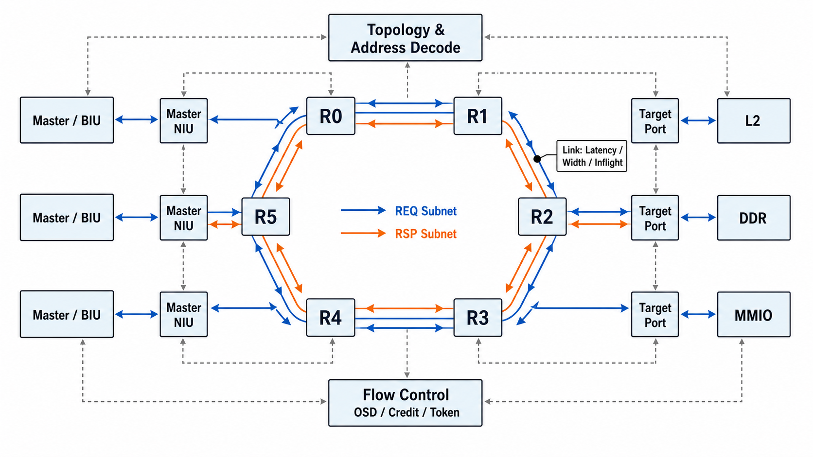

# AI Core Ring 互连模型总体方案书

面向 CA/ESL 仿真的 message-level 双向 Ring 建模方案

## 文档信息

| 项目 | 内容 |
|---|---|
| 受众 | 资深架构师、CA 模型负责人、SoC 性能建模评审人员 |
| 代码范围 | `BUS/aicore/tm_ring_*`、`tm_bus_flow_ctrl`、`tm_pld`、`pem_config_cloud.toml` |
| 文档目的 | 统一当前 Ring 模型方案、模块资源边界、数据流、可调参数、统计口径和后续优化路线 |
| 方案状态 | 基于当前仓库实现，不从零重写，不引入并行互连框架 |

## 1. 执行摘要

当前 AI Core 互连模型已经从历史 Mesh 命名收敛到一维双向 Ring 实现。模型以 `TmRingFabric` 为装配顶层，按 Master、Router、Link、TargetPort 四类资源构建互连；每个 Router 是一个 ring stop，具备 LOCAL 注入/弹出端口，以及 EAST/WEST 两个方向端口。

模型的核心定位是轻量级 CA/ESL 性能建模，而不是 RTL 精确协议仿真。它保留事务级协议阶段和逐跳 backpressure，重点表达拓扑路径、链路序列化、目标端流控、端到端 outstanding 和瓶颈统计。当前实现不拆 flit，不实现 VC，也不建模 AXI4 五通道逐拍时序。

核心设计原则如下：

- 端点保存事务状态：`TmRingInf` 保存 Master 侧 API 请求、写数据暂存和 OSD；`TmRingTargetPort` 保存 Target 侧 request queue 和 response throttle。
- Router 保持轻量：只做 EAST/WEST 输入短缓存、LOCAL 注入/弹出、下一跳选择和 Round-Robin 仲裁。
- Link 独立表达传播和序列化：`tm_que` 表示固定传播延迟，`next_send_time_` 表示链路发送器被 packet 占用的周期。
- Target flow control 复用 `TmBusFlowCtrl`：统一维护 target slot credit、bandwidth token、target outstanding 和 global OSD。
- 全系统遵循无丢包反压规则：下游成功接收后才 pop 上游；下游不可接收时保留队头，不增加显式 retry event。

## 2. 建模目标与边界

### 2.1 建模目标

1. 支持多 Master、多 Target 的 AI Core Ring 互连拓扑。
2. 支持 `RD`、`WR`、`WR_DAT`、`RD_RSP`、`WR_RSP`、`RSP` 等事务阶段。
3. 支持两阶段写事务：`WR -> WR_RSP/grant -> WR_DAT -> RSP`。
4. 支持多路读响应 lane，通过 `ring_rsp_lane` 区分。
5. 支持 LINEAR 与 XOR_HASH 地址交织。
6. 支持 Master OSD、Global OSD、Target slot credit、Target bandwidth token 和 Link serialization stall。
7. 输出足够的性能观测信息，用于判断瓶颈来自 endpoint、target、link 还是拓扑热点。

### 2.2 非目标

- 不实现 flit、virtual channel、VC allocator 或 switch allocator。
- 不实现 cache coherence、snoop 或一致性网络。
- 不追求 AXI4 五通道 RTL 级别时序。
- 不在 Fabric 中维护大型全局事务生命周期表。
- 不把 `TmInf` 当作主要缓存资源；真实缓存由 `TmQue` 表达。

## 3. 总体架构



当前模型由四层组成：

| 层级 | 主要模块 | 职责 |
|---|---|---|
| Endpoint 接入层 | `TmRingInf`、`TmRingTargetPort` | 连接 BIU/TmMem，保存端点队列、事务状态、写数据暂存和 response throttle |
| Ring stop 层 | `TmRingRouter` | EAST/WEST 到站短缓存、LOCAL 注入/弹出、稳定 slot Round-Robin 仲裁、下一跳选择 |
| 链路层 | `TmRingLink` | 有向链路、REQ/RSP 独立 in-flight 队列、固定传播延迟、序列化带宽占用 |
| 控制与映射层 | `TmRingTopology`、`TmBusFlowCtrl` | 地址到 Target 映射、Master/Target node 映射、最短路径路由、Target 级 credit/token/OSD |

Ring 中存在两个逻辑 subnet：

- `REQ subnet`：承载 `RD`、`WR`、`WR_DAT`。
- `RSP subnet`：承载 `RD_RSP`、`WR_RSP`、`RSP`。

## 4. 模块资源与职责

### 4.1 `TmRingFabric`

`TmRingFabric` 是顶层装配器，负责创建和连接所有子模块。

核心资源：

- `master_nius_`：每个 Master 一个 `TmRingInf`。
- `routers_`：每个 ring stop 一个 `TmRingRouter`。
- `links_`：有向 Link 表，key 编码 `src_router/src_dir/dst_router/dst_dir`。
- `target_ports_`：每个 Target 一个 `TmRingTargetPort`。
- `topology_`：地址解码、Master/Target 节点映射和下一跳方向。
- `flow_ctrl_`：Target 侧 credit/token/outstanding 和 global OSD。

职责边界：

- Fabric 负责创建、连接、reset、idle 汇总和统计聚合。
- Fabric 不直接保存 packet，不执行逐跳路由，不处理 Memory 握手。

### 4.2 `TmRingInf`

`TmRingInf` 是 Master 侧网络接口单元，位于 BIU/API 与本地 Router 之间。

核心资源：

- `bus_inf_`：面向 BIU/API 的 valid-ready 接口。
- `router_inf_`：面向本地 Router LOCAL master port 的接口。
- `rd_cmds_`：读命令本地 FIFO。
- `wr_cmds_`：写命令本地 FIFO。
- `wr_data_`：等待注入 Ring 的写数据 FIFO。
- `wr_dat_rsp_q_`：等待返回 BIU 的写数据响应 FIFO。
- `req_map_`：API 请求完成状态。
- `pending_writes_`：保存原始写请求 payload，用于收到 `WR_RSP` 后生成新的 `WR_DAT`。
- `rd_rsp_states_`：多分片读响应完成计数。
- `rd_outstanding_`、`wr_outstanding_`：Master 侧 OSD。

主要职责：

- 从 `bus_inf_` 接收 `RD/WR/WR_DAT`。
- 将请求落入本地 FIFO，队列满时不 pop 上游。
- 注入 Ring 前填写 `mst_id`、`target_id`、`src_node`、`dst_node`、`ring_subnet`、`ring_traffic_class`。
- 处理返回的 `RD_RSP/WR_RSP/RSP`。
- 在 `WR_RSP` 到达后 clone 原始写请求生成独立 `WR_DAT`，避免同一个 shared pointer 在 WR 和 WR_DAT 阶段复用。
- 在完整事务完成后释放 Master OSD 和 Target credit。

### 4.3 `TmRingRouter`

`TmRingRouter` 是一个 ring stop，只负责短缓存、仲裁和转发。

核心资源：

- `port_infs_`：EAST/WEST 到站输入接口，承接相邻 Link 的输出。
- `req_input_qs_`：EAST/WEST 的 REQ subnet 输入缓存。
- `rsp_input_qs_`：EAST/WEST 的 RSP subnet 输入缓存。
- `local_master_infs_`：本地 Master 接口。
- `local_target_infs_`：本地 Target 接口。
- `east_link_`、`west_link_`：两个方向的输出 Link。
- `input_rr_ptr_`、`output_rr_ptr_`：稳定 slot Round-Robin 仲裁状态。

Router 的输入缓存只放在 EAST/WEST 方向。LOCAL 侧不额外加 Router FIFO，因为 Master NIU 和 TargetPort 已经有端点缓存；输出侧也暂不加 output buffer，因为 Link 本身就是输出方向的 pipeline/buffer。

### 4.4 `TmRingLink`

`TmRingLink` 是有向链路，连接一个 Router 输出端口和下一个 Router 输入端口。

核心资源：

- `dst_out_inf_`：Link 到下游 Router 的发送端口。
- `inflight_packets_`：每个 subnet 一个 `TmQue`，表达传播延迟中的在途 packet。
- `inflight_count_`：每个 subnet 当前在途 packet 数。
- `next_send_time_`：每个 subnet 的发送器下一次可接受时间。
- `width_bytes_`：链路每周期可序列化发送的字节数。
- `latency_`：固定传播延迟。
- `stats_`：per-link、per-subnet 统计。

`TmRingLink` 不拆 packet。一个 128B 的 `RD_RSP` 仍然作为一个 packet 传输，但会按 `ring_link_width_bytes` 计算 serialization cycles。例如 link width 为 16B/cycle 时，128B 响应占用 8 cycle。

### 4.5 `TmRingTargetPort`

`TmRingTargetPort` 是 Target 侧网络接口单元，位于本地 Router 与 TmMem/Memory 后端之间。

核心资源：

- `ring_inf_`：连接本地 Router LOCAL target port。
- `inf_`：连接 TmMem 的读写接口。
- `rd_req_q_`：读请求 FIFO。
- `wr_req_q_`：写命令 FIFO。
- `wr_dat_q_`：写数据 FIFO。
- `next_req_issue_time_`：Target 请求发射节奏。
- `next_rd_rsp_issue_time_`：每个读响应 lane 的返回节奏。
- `next_wr_req_rsp_issue_time_`：写 grant 响应节奏。
- `next_wr_dat_rsp_issue_time_`：写完成响应节奏。

TargetPort 负责和 Memory 交互，因此 flow-control 资源在请求真正发给 Memory 后才 consume；响应成功注入 Ring 后才从 Memory response 接口 pop。

## 5. 请求与响应数据流

### 5.1 读请求路径

1. BIU 或 API 在 `TmRingInf::bus_inf_` 发送 `RD`。
2. `TmRingInf::recv_rd_cmd()` 将请求放入 `rd_cmds_`。
3. `TmRingInf::send_rd_cmd()` 填写 Ring metadata 并通过 `router_inf_` 注入本地 Router。
4. Router 根据目的节点选择 `LOCAL/EAST/WEST`。
5. 跨节点 packet 进入 `TmRingLink`，Link 计算 header bytes、serialization cycles 和传播延迟。
6. 到达目标 Router 后通过 LOCAL 端口送入 `TmRingTargetPort::ring_inf_`。
7. TargetPort 将请求放入 `rd_req_q_`，检查 FlowCtrl 后发送到 TmMem。
8. TmMem 返回读响应，TargetPort 转成 `RD_RSP` 并注入 RSP subnet。
9. 响应沿 Ring 回到源 Master，`TmRingInf` 收到全部分片后完成事务。

### 5.2 写请求路径

1. `WR` 进入 `TmRingInf::wr_cmds_`，原始 payload 同时保存到 `pending_writes_`。
2. `WR` 经 REQ subnet 到达 TargetPort 的 `wr_req_q_`。
3. TargetPort 发送写命令到 TmMem，Memory 返回 `WR_RSP` grant。
4. `WR_RSP` 经 RSP subnet 回到 `TmRingInf`。
5. `TmRingInf` 按 gid 从 `pending_writes_` 找回原始写数据，clone 出新的 `WR_DAT` payload。
6. `WR_DAT` 经 REQ subnet 到达 TargetPort 的 `wr_dat_q_`。
7. TmMem 返回最终 `RSP`，`TmRingInf` 释放 write OSD、Target credit，并清理写事务状态。

### 5.3 Payload 元数据

| 字段 | 用途 | 设计理由 |
|---|---|---|
| `gid` | Master 内事务编号 | 不同 Master 可以复用 gid，因此跨 Master key 需要组合 `mst_id` |
| `mst_id` | 发起 Master 标识 | 响应回源时通过 Topology 反查 Master port |
| `slv_id` | Target ID | 请求到达目标 Router 后弹出到对应 TargetPort |
| `mst_addr/slv_addr` | 复用为 source node / destination node | 避免额外全局 route context 表 |
| `ring_subnet` | `REQ` 或 `RSP` | packet 生命周期中基本稳定 |
| `ring_traffic_class` | 对应 `PldCmd` | 区分 RD、WR、WR_DAT、RD_RSP、WR_RSP、RSP |
| `ring_rsp_lane` | RD response lane | 支持多路读响应 |

## 6. 流控、时序和容量模型

### 6.1 统一反压规则

所有模块遵循同一条反压规则：

```text
下游可以接收：
    send/push 下游
    pop 上游

下游不能接收：
    不 send
    不 push
    不 pop
    保留 FIFO 队头
```

因此当前方案不需要新增 `retry_event_`，也不使用 `notify_after(1)` 做重试。`TmInf` 和 `TmQue` 的 `vld/rdy` 事件负责后续自动推进。

### 6.2 Link serialization

Link 的 packet bytes 口径如下：

| 包类型 | 序列化字节数 | 说明 |
|---|---|---|
| `RD` | 请求头 16B | 读请求不携带完整读取数据 |
| `WR` | 请求头 16B | 写命令阶段只携带地址和控制信息 |
| `WR_DAT` | payload size | 写数据真实占用 REQ link 带宽 |
| `RD_RSP` | payload size | 读响应真实占用 RSP link 带宽 |
| `WR_RSP` | 响应头 16B | grant/DBID 阶段不携带写数据 |
| `RSP` | 响应头 16B | 写完成响应只表达状态 |

serialization cycles 计算公式：

```text
serialization_cycles = max(1, ceil(packet_bytes / ring_link_width_bytes))
```

### 6.3 Target flow control

`TmBusFlowCtrl` 维护 Target 级资源：

- `global_outstanding_`：系统级 RD/WR transaction OSD。
- `rd_slot_credit_`、`wr_slot_credit_`、`acc_slot_credit_`：Target slot credit。
- `rd_bw_token_`、`wr_bw_token_`、`acc_bw_token_`：Target bandwidth token。
- `target_outstanding_`：每个 Target 当前未完成事务数。
- hotspot penalty：当某 Target outstanding 超过阈值后附加延迟惩罚。

注意：`target_width_bytes` 表示 Target 前端/响应路径宽度，影响 Target issue/rsp busy cycles；`ring_link_width_bytes` 表示 Ring Link 序列化宽度，影响 packet 在链路上的占用周期。两者属于不同资源层级，不能混为一个参数。

## 7. 配置体系

当前配置集中在 `BUS/aicore/config/pem_config_cloud.toml`：

- `[ARCH]`、`[DDR]`、`[L2]`、`[BIU]`：PEM runtime 和 DDR/TmMem 参数。
- `[RING_DEMO]`：Ring demo 全局参数。
- `[RING_DEMO.case.*]`：case 级覆盖参数。

关键参数如下：

| 参数 | 当前示例 | 建模对象 | 调参影响 |
|---|---:|---|---|
| `num_masters` | 4 | Master/NIU 数量 | 增加并发源数量和 ring stop 数 |
| `num_targets` | 4 | TargetPort 数量 | 增加 memory partition 数量和地址交织宽度 |
| `target_width_bytes` | 32 | Target 前端/响应带宽 | 影响 Target issue/rsp busy cycles |
| `master_fifo_depth` | 16 | NIU 本地 FIFO 深度 | 影响端点排队能力，不等同于 OSD |
| `master_rd_osd` / `master_wr_osd` | 16 / 16 | Master outstanding | 限制每个 Master 同时在网事务数 |
| `global_osd` | 64 | 全局 outstanding | 限制系统级并发事务数 |
| `target_rd_osd` / `target_wr_osd` / `target_acc_osd` | 16 / 16 / 32 | Target slot credit | 限制每个 Target 可接收事务数 |
| `ring_link_latency` | 1 | Link propagation latency | 影响每跳固定传播延迟 |
| `ring_link_width_bytes` | 16 | Link serialization width | 影响 RD_RSP/WR_DAT 等大包链路占用 |
| `ring_router_input_depth` | 2 | Router EAST/WEST input FIFO | 帮助 Link 尽快释放 in-flight |

## 8. 统计与瓶颈诊断

当前测试输出包含：

| 输出项 | 含义 | 诊断方式 |
|---|---|---|
| `TEST_PERF` | 总周期、B/cycle、GB/s | 判断吞吐是否达到目标 |
| `TEST_STALLS` | endpoint/fabric/all stall 合计 | 区分端点压力和互连压力 |
| `TEST_BOTTLENECK` | global OSD、target slot、token、link stall | 定位主导瓶颈类别 |
| `TEST_LINK_HOTSPOT` | Top REQ/RSP link 包数、字节、busy、stall | 判断全 Ring 均匀打满还是局部热点 |
| `TEST_FAIRNESS` | Jain fairness index | 判断多 Master 竞争公平性 |
| `TEST_IDLE` | ring/demo/biu/target idle | 确认结束时无残留事务 |

per-link hotspot 的使用建议：

- 如果 RSP subnet 的少数 link 明显最热，优先检查 Target 分布、地址交织和读响应路径。
- 如果 REQ subnet 的少数 link 最热，优先检查 Master 分布、写数据方向和热点地址。
- 如果多条 link 接近满载，说明整个 Ring 链路宽度或平均 hop 数已经成为系统性瓶颈。
- 如果 Link stall 很低但 Target stall 很高，说明瓶颈不在 Ring，而在 Target bandwidth token 或 OSD。

## 9. 验证计划

| 验证类别 | 用例 | 通过标准 |
|---|---|---|
| 功能正确性 | 单 Master 读/写、多 Master 并发、读写混合 | 事务完成、memory check 无 mismatch、idle 全为 true |
| 写事务协议 | `WR -> WR_RSP -> WR_DAT -> RSP` | `WR_DAT` 只在 grant 后发出，最终 `RSP` 才释放 write OSD |
| 多路读响应 | 多 lane `RD_RSP` | 所有分片到齐后才释放 Master read OSD |
| 反压 | 降低 target FIFO、router input depth、link width | 队头保留、不丢包、无显式 retry event |
| 地址交织 | LINEAR、XOR_HASH、热点 stride、单 Target hotspot | Target 分布符合配置，热点能反映到统计 |
| 容量扫描 | Master OSD、Global OSD、Target OSD、Link width、Router input depth | 吞吐随资源增加先提升后饱和，dominant bottleneck 可解释 |
| 公平性 | 多 Master 持续竞争同一方向链路 | Jain index 接近 1，无固定 Master 饥饿 |

## 10. 风险、限制与后续路线

### 10.1 当前限制

- Link serialization 以完整 packet 占用发送资源，不拆分 flit，因此不能观察 beat-level 队列占用。
- Router pipeline 简化为事件触发的输入仲裁，不区分 route compute、switch allocation、crossbar traversal 等细粒度 stage。
- Target response lane 的分片策略依赖 Memory 返回和 `rsp_count` 元数据，尚未加入更复杂的 burst split 策略。
- latency breakdown 尚未细分到 Master 等待、Router 等待、Link propagation、Target queue、Memory latency 等阶段。
- 模型精度需要通过 RTL、原 CA 模型或实测平台校准，不能直接宣称固定误差比例。

### 10.2 后续路线

| 阶段 | 目标 | 主要工作 | 收益 |
|---|---|---|---|
| P0 | 稳定性收敛 | 补齐多 case 自动测试、reset/idle/underflow 检查 | 保证模型可信和可回归 |
| P1 | 瓶颈可观测性 | 完善 per-link/per-target/per-master 统计，输出 top hotspot 和 CSV | 快速判断热点来源 |
| P2 | 性能校准 | 扫描 link width、target width、OSD、router input depth，与参考结果拟合 | 得到可解释参数组合 |
| P3 | 精度增强 | 增加 latency breakdown、响应分片策略、可选 router pipeline stage | 提升架构评审解释力 |
| P4 | 工具化 | 固化 demo case、参数覆盖、性能报表脚本 | 降低使用门槛 |

## 附录 A. 源文件映射

| 文件 | 角色 |
|---|---|
| `BUS/aicore/tm_ring.h` / `tm_ring_core.cc` | Fabric 顶层、模块创建连接、全局统计聚合 |
| `BUS/aicore/tm_ring_types.h` | Ring 类型、命令/通道映射、配置结构 |
| `BUS/aicore/tm_ring_inf.h` / `tm_ring_inf.cc` | Master 侧 NIU，请求缓存、响应返回、API 完成、两阶段写 |
| `BUS/aicore/tm_ring_router.h` / `tm_ring_router.cc` | Ring stop，LOCAL/EAST/WEST 仲裁和转发 |
| `BUS/aicore/tm_ring_link.h` / `tm_ring_link.cc` | 有向链路，传播延迟、序列化和 per-link 统计 |
| `BUS/aicore/tm_ring_target_port.h` / `tm_ring_target_port.cc` | Target 侧 NIU，Memory 请求/响应和 response throttle |
| `BUS/aicore/tm_ring_topology.h` / `tm_ring_topology.cc` | 地址解码、Target/Master 节点映射、最短路径路由 |
| `BUS/aicore/tm_bus_flow_ctrl.h` / `tm_bus_flow_ctrl.cc` | Target slot credit、bandwidth token、global/target outstanding |
| `BUS/aicore/tm/tm_pld.h` / `tm_pld.cc` | 公共 payload 和 Ring metadata helper |
| `BUS/aicore/tm_ring_demo_test.h` / `tm_ring_demo_config.*` | 独立 ESL demo、参数装载、结果统计输出 |
| `BUS/aicore/config/pem_config_cloud.toml` | PEM + Ring demo 统一配置 |

## 附录 B. 架构评审 Checklist

- 确认 Ring stop 数、Master 分布和 Target 分布是否符合预期场景。
- 确认 `target_width_bytes` 与 `ring_link_width_bytes` 分别代表 Target 前端吞吐和 Ring 链路序列化宽度。
- 确认 `master_fifo_depth` 与 `master_rd_osd/master_wr_osd` 的边界：前者是本地排队，后者是在网事务上限。
- 查看 `TEST_BOTTLENECK` 判断瓶颈类别，再查看 `TEST_LINK_HOTSPOT` 判断是否局部热点。
- 运行 reset 后重跑 case，确认 idle、credit、outstanding 和 `pending_writes_` 均无泄漏。
- 调参时优先按瓶颈口径调整：Link 瓶颈调 link width/capacity/router input；Target 瓶颈调 target width/token/OSD；endpoint 瓶颈调 Master FIFO/OSD。
