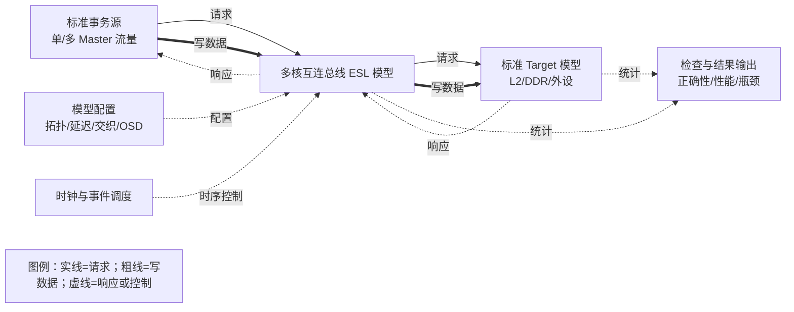
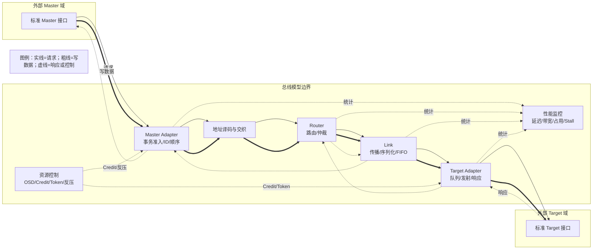
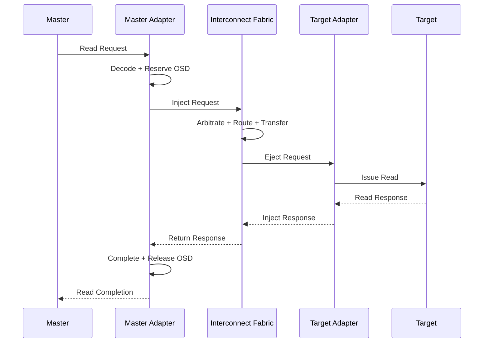
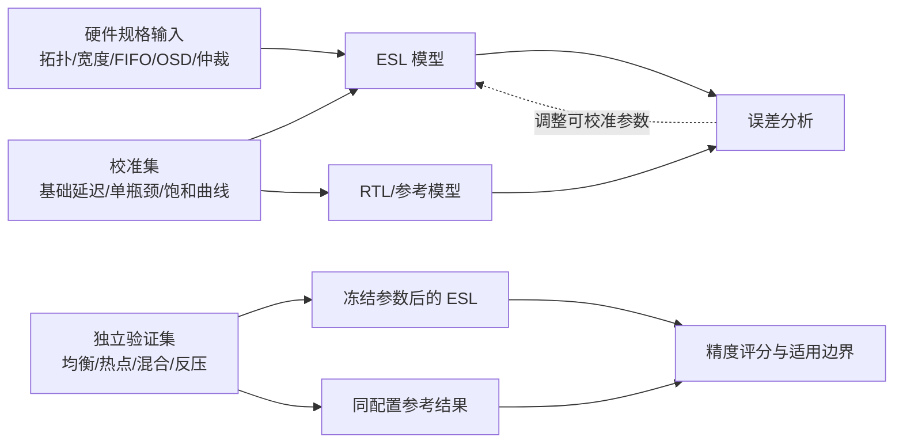

# 多核互连总线 ESL 性能模型方案与架构

## 摘要

本文提出一套面向多 Core 场景的片上互连总线 ESL（Electronic System Level）性能模型。模型通过
标准事务接口连接流量源和 Target，不依赖完整 SoC 即可独立构造、运行和分析多核访问场景；通过
可配置的拓扑、地址交织、链路延迟、链路带宽、队列深度、仲裁策略和多级 OSD，复现总线中的
多跳传输、共享资源竞争、热点访问和下游反压；通过端到端延迟、吞吐、资源利用率和阻塞统计，
识别系统关键瓶颈。

模型优先采用双向 Ring 作为互连方案。Ring 能够在较低建模复杂度下保留多跳路径、方向竞争、
链路序列化和局部热点等关键行为，同时保留理想 Crossbar 或共享总线模型作为性能参照。模型采用
事务级、周期近似的抽象方式，不追求 RTL 逐信号一致，而是关注架构趋势、瓶颈位置和参数变化
带来的性能影响。性能精度目标约为 80%，该目标需要通过可信架构模型或 RTL 仿真完成校准和验证，
在对标完成前不作为已达到的结论。

## 1 项目背景与目标

多 Core 系统中，多个 Master 会同时访问 L2、DDR 或其他共享 Target。系统性能不仅取决于单个
Master 或 Target 的能力，还受到地址映射、互连路径、链路宽度、队列深度、仲裁、OSD 和反压的
共同影响。如果性能验证依赖完整 SoC 环境，模型集成和调试周期较长，也难以单独调整总线参数并
快速定位瓶颈。

本项目的目标是建立一套独立、参数化的总线 ESL 模型，主要解决三个问题。

第一，模型需要适配多 Core 或多 Master 场景，不依赖完整 SoC 即可运行。流量源、总线和 Target
通过标准事务接口连接，使同一套模型既可以独立使用，也可以在后续接入系统级模型。

第二，模型需要表达总线的结构性性能因素。固定流水延迟、动态排队延迟、链路序列化、拓扑跳数、
地址交织、仲裁、OSD、队列和 Target 服务能力均可配置，并能够形成真实的共享资源竞争、热点和
逐级反压。

第三，模型需要具备可验证的性能精度。目标是相对可信参考对象达到约 80% 的综合性能精度，重点
对齐吞吐、平均与尾延迟、资源利用率、带宽分配、瓶颈位置和配置变化趋势，而不是追求 RTL 级逐拍
一致。

## 2 模型定位与边界

### 2.1 模型定位

模型定位为事务级、周期近似的 CA/ESL 性能模型。每笔事务具有明确的发起端、目标端、命令、
地址、长度、数据、顺序属性和时间戳。模型按照离散事件或周期推进事务，资源不足时事务保持在
当前队列，资源释放后继续前进。

该模型适合用于以下分析：

- 多 Core 均匀访问和热点访问的性能差异；
- Ring、共享总线和理想 Crossbar 的相对性能；
- 地址交织对 Target 负载和链路热点的影响；
- Link width、Link latency、FIFO 和 OSD 的参数敏感性；
- L2、DDR 等不同 Target 服务能力对系统性能的影响；
- 读写混合、长短事务混合和持续反压场景；
- 总线瓶颈位于 Master、Router、Link、Target 还是全局资源。

### 2.2 模型内部与外部边界



模型内部负责端点适配、地址译码、路由、仲裁、链路传输、OSD、队列、反压和性能统计。外部
Target 负责实际服务语义，例如 L2 命中处理、DDR 访问延迟或外设响应。两者的延迟边界需要明确，
避免同一段服务延迟被重复计算。

模型不包含 Cache Coherence、Snoop、MMU/IOMMU、软件协议、物理布线和 RTL 逐信号行为。若后续
需要评估 Flit 交错、虚通道分配或 Wormhole Blocking，应在现有事务模型上增加更细粒度的传输
抽象。

## 3 总体架构

### 3.1 分层设计

模型采用端点适配、互连传输、资源控制和观测配置四层架构。



端点适配层屏蔽外部接口差异，负责事务接收、标识、顺序管理和完成。互连传输层完成地址译码、
Router 仲裁、多跳路由和 Link 传输。资源控制层维护 OSD、Credit、FIFO、Inflight 和带宽 Token。
观测配置层负责参数加载、合法性检查、性能采集和结果输出。

### 3.2 模块职责

| 模块 | 主要职责 | 对应的性能资源 |
|---|---|---|
| Master Adapter | 接收事务、维护 ID 和顺序、预留 OSD、注入请求、回收响应 | 入口 FIFO、Read/Write OSD、响应队列 |
| 地址译码与交织 | 根据地址范围和交织规则选择 Target | 译码流水延迟、地址分布 |
| Router | 计算方向、形成候选、输出仲裁、转发事务 | Router Pipeline、输入/输出竞争 |
| Link | 相邻节点间逐跳传输 | Link latency、width、FIFO、max inflight |
| Target Adapter | 接收请求、Target 准入、控制发射节拍、注入响应 | Target FIFO、Target OSD、Token |
| 资源控制 | 管理 Master/Global/Target OSD 和 Credit 生命周期 | Tracker、Slot、共享队列容量 |
| 性能监控 | 采集事务时间戳、占用、吞吐和阻塞 | 统计采样，不参与数据调度 |

## 4 拓扑方案

### 4.1 方案比较

| 方案 | 特点 | 适用性 |
|---|---|---|
| 共享总线 | 结构简单，所有端点竞争单一共享资源，扩展性较弱 | 可作为低复杂度性能基线 |
| Crossbar | 端到端路径短，不同 Target 可并行，端口规模增大后面积和时序压力明显 | 适合端点数量较少、低延迟场景，可作为理想上界 |
| 双向 Ring | 连接规则固定，能够表达多跳、方向竞争和局部热点，复杂度适中 | 作为本项目主要研究方案 |
| Mesh/NoC | 扩展性较好，可支持复杂路由和 QoS，但建模、验证和校准成本较高 | 可作为后续扩展方向 |

本项目优先采用双向 Ring。选择 Ring 的主要原因不是结构简单，而是它能够在 ESL 模型中保留
多核互连最重要的结构性性能特征：事务经过不同跳数、不同流量会竞争部分共享链路、热点 Target
会在其相邻 Link 和返回路径形成拥塞，同时不同方向和不同链路仍可以并行工作。

为了判断 Ring 自身带来的路径损耗，模型可以保留理想 Crossbar 或共享总线作为参照。这样可以
区分性能限制来自拓扑，还是来自 Master OSD、Target 服务能力或地址分布。

### 4.2 Ring 节点和路由

每个 Master 或 Target 通过本地端口接入一个 Router，Router 之间以两个方向的有向 Link 形成
双向闭环。端点位置既可以按均衡规则自动生成，也可以通过配置显式指定，以研究 Floorplan、平均
跳数和热点链路的影响。

路由采用确定性最短路径。Router 分别计算两个方向到目标节点的跳数，选择距离较短的方向；距离
相同时使用固定 Tie-Break 规则。确定性路由便于结果重放、链路负载分析和后续与 RTL 对齐。

```text
forward_hops  = (destination - current + node_count) mod node_count
backward_hops = (current - destination + node_count) mod node_count
```

## 5 事务模型

### 5.1 事务信息

总线内部事务与外部接口解耦，至少包含以下信息：

| 字段 | 含义 |
|---|---|
| Transaction ID | 端到端唯一事务标识 |
| Master ID | 发起端标识 |
| Target ID | 目标端标识 |
| Traffic Class | 读请求、写命令、写数据或响应类别 |
| Address/Size | 访问地址和有效载荷大小 |
| Data/Buffer | 数据或数据缓冲引用 |
| Ordering Domain | 顺序域、优先级或 QoS 属性 |
| Expected Response Count | 多响应事务预计返回数量 |
| Returned Response Count | 已返回数量，用于判断完成 |
| Timestamp | 各关键阶段的性能时间戳 |

Payload 在事务完成前不能被释放或复用。多响应事务只有在返回数量达到预计数量，并收到协议规定
的终态响应后，才能释放 Master OSD 和事务上下文。

### 5.2 读事务



读事务在 Master Adapter 接受时创建上下文并申请资源，经过请求路径到达 Target。Target 完成处理
后，响应沿返回路径到达原 Master。只有完整读响应返回后，事务才完成。

### 5.3 写事务

模型支持写命令和写数据分离的事务形式。写命令首先到达 Target，Target 返回 Grant 或中间响应，
随后写数据进入总线，最终写完成响应返回 Master。

```text
Write Command -> Grant -> Write Data -> Final Response
```

同一写事务在各阶段使用稳定的端到端 ID。写命令和写数据只占用一次 Write OSD，Grant 不能作为
写事务完成点，只有终态响应返回后才能释放完整事务资源。若目标协议不包含 Grant，模型可将中间
阶段配置为旁路，但完成语义保持不变。

### 5.4 顺序性

同一 Transaction ID 内的命令、数据和响应严格关联；同一 Ordering Domain 内是否保序由配置
决定；不同 Transaction ID 默认允许在不同 Target 和不同路径间乱序完成。若上游接口要求保序，
由 Master Adapter 根据事务属性恢复响应顺序。

模型需要明确同地址读写、Barrier/Fence 和多响应事务的完成规则，避免由 FIFO 的偶然顺序替代
协议顺序定义。

## 6 地址译码与交织

每个 Target 配置地址起始位置和地址空间大小。地址首先通过地址范围匹配，再根据交织规则计算
Target。未命中地址可进入默认 Target 或返回错误，具体行为由配置决定。

### 6.1 LINEAR 交织

```text
stripe = floor((address - base_address) / interleave_size)
target = stripe mod target_count
```

LINEAR 交织将连续地址按固定粒度轮转到多个 Target，适合连续访问和负载均衡分析。

### 6.2 XOR_HASH 交织

```text
stripe = floor((address - base_address) / interleave_size)
hash = stripe XOR (stripe >> hash_shift) XOR hash_seed
target = hash mod target_count
```

XOR_HASH 将高位地址特征折叠到 Target 选择位，可以缓解多个 Master 使用固定地址步长时产生的
同步热点。`interleave_size`、`hash_shift` 和 `hash_seed` 均为配置项，配置加载时检查地址范围、
交织粒度和 Target 集合是否合法。

## 7 延迟与带宽模型

### 7.1 端到端延迟

端到端延迟由多个阶段共同形成：

```text
T_total = T_source_queue
        + T_master_adapter
        + T_router_arbitration
        + T_router_pipeline
        + T_link_propagation
        + T_link_serialization
        + T_target_queue
        + T_target_service
        + T_response_path
```

该表达用于延迟归因，不表示所有阶段都必须简单串行相加。不同事务的 Router Pipeline、Link 传播
和 Target 服务可能重叠。模型按资源最早可用时间推进事务：

```text
t_link_start  = max(t_packet_ready, t_link_available)
t_next_router = t_link_start + serialization_cycles + propagation_latency
t_target_issue = max(t_arrival, t_target_available, t_credit_available)
```

固定流水延迟由配置决定，仲裁等待、队列等待和反压延迟根据运行状态动态产生。每个阶段记录时间戳，
使总延迟能够分解到具体资源。

### 7.2 链路序列化

Link 具有固定传播延迟、传输宽度、FIFO 深度和最大在途包数量。包占用 Link 的周期数为：

```text
serialization_cycles = max(1, ceil(packet_bytes / link_width_bytes))
```

请求头、写数据、读响应和轻量响应可以具有不同字节数。Link latency 决定包到达下一跳的时间，
serialization cycles 决定同一 Link 何时可以接收后续传输。`max_inflight` 只改变链路能够吸收的
突发数量，不提高物理带宽。

### 7.3 Router 和 Target

Router 延迟可以拆分为路由计算、输出仲裁、交换和转发流水。第一阶段可使用统一的 Router 固定
流水参数，但输出竞争产生的等待时间必须动态建模。

Target Adapter 的请求发射间隔可表示为：

```text
T_issue = frontend_latency
        + forward_latency
        + header_latency
        + ceil(payload_size / target_width)
        + hotspot_penalty
```

外部 Target 自身的服务延迟单独配置。L2 可使用较低固定延迟和较高并发能力，DDR 可使用更长
延迟、有限队列和更明确的吞吐约束，从而比较不同 Target 对总线的影响。

### 7.4 有效吞吐上界

```text
BW_effective <= min(BW_master_injection,
                    BW_network,
                    BW_arbitration,
                    BW_target,
                    BW_outstanding)

BW_outstanding ~= OSD * average_payload / average_latency
```

OSD 近似公式适用于稳定流量、事务长度明确且没有额外顺序阻塞的情况。多响应事务、读写混合和
Target 长尾延迟需要由离散事件模型计算实际结果。

Ring 的网络上界不能简单使用所有 Link 带宽之和。对于给定 Traffic Matrix，需要统计每条有向
Link 的路由负载，由最重载 Link 或最小截面决定拓扑上界。

## 8 OSD、Credit 与反压

### 8.1 分层 OSD

| 层级 | 资源 | 占用时机 | 释放时机 |
|---|---|---|---|
| Master | Read OSD | Master 接受读事务 | 完整读响应返回 |
| Master | Write OSD | Master 接受写事务 | 写终态响应返回 |
| Global | Global OSD | 事务注入网络前 | 事务终态响应返回 |
| Target | Read/Write/Access OSD | 地址译码后预留 Target 资源 | 对应 Target 事务完成 |

建议在地址译码后、网络注入前完成 Master、Global 和 Target 资源预留。只有各级资源同时满足时，
事务才能进入网络。这样可以减少已经没有 Target 资源的事务占满 Ring。若实际硬件采用 Target
Admission，可切换为目标端准入模式，并重新评估网络内排队和 Credit 返回时延。

OSD 统一以完整事务数为单位。写命令、Grant 和写数据属于同一写事务，不重复占用 Write OSD。
异常结束或超时时必须回收已预留资源，运行结束时所有 Outstanding 必须归零。

### 8.2 FIFO、Inflight 和 Token

FIFO 表示局部缓冲容量，Link Inflight 表示进入链路但尚未送达下游的包数量，OSD 表示已接受但
尚未完成的端到端事务数量，三者的物理含义不同，不要求数值一一对应。

Target 带宽可以通过 Token 模型控制。Token 容量决定突发能力，补充量和补充周期决定长期平均
带宽。数据传输按有效字节消耗 Token；写命令不重复消耗写数据带宽。

### 8.3 反压

下游不可接收时，上游保持当前事务 Valid，不弹出队列，也不释放资源。资源恢复后由原队列继续
尝试发送，不额外设计独立 Retry 协议。反压可以从 Target Adapter、目的 Router、Link、上游
Router 一直传播到 Master Adapter。

```text
downstream_ready AND send_success
    -> commit transaction and pop source queue
otherwise
    -> retain transaction and wait for next scheduling opportunity
```

请求和响应建议使用独立 Virtual Network 或具有等效保留资源，使响应、写 Grant 和 Credit Return
不被普通请求完全阻塞。若请求和响应共享物理链路，需要配置虚通道、保留 Buffer 或 Escape
Priority，以避免闭环资源依赖形成死锁。

## 9 多核竞争与仲裁

多 Core 流量必须在模型中真实进入共享受限资源。不同 Master 可以同时在不同 Link 上并行，但当
它们访问相同 Target、经过相同方向或竞争相同 Router 输出时，应在相应资源处形成排队，而不能
通过独立旁路绕过竞争。

Router 建议采用两级仲裁。输入级仲裁从一个输入端的多个 Traffic Class 中选出候选事务；输出级
仲裁从竞争同一输出端口的多个输入候选中选出唯一 Winner。基础策略使用 Round-Robin，仲裁指针
仅在成功发送后更新，以保证确定性和长期公平。后续可以扩展固定优先级、Weighted Round-Robin
和 Age-Based 策略，用于研究 QoS 和最坏等待时间。

仲裁结果不仅影响平均吞吐，也会影响响应返回、写数据推进和不同 Master 的带宽分配。因此模型
需要统计每个输出端口的冲突次数、等待周期、服务份额和公平性。

## 10 关键瓶颈模型

模型通过限制不同资源形成可解释的瓶颈：

| 瓶颈位置 | 主要参数 | 主要表现 |
|---|---|---|
| Master 准入 | Read/Write OSD、入口 FIFO | 注入不足，Link 未饱和 |
| 全局资源 | Global OSD | 多个 Master 同时被全局 Tracker 限制 |
| Router | 仲裁策略、Pipeline、输出压力 | 输出冲突和等待周期上升 |
| Link 带宽 | Link width、包长 | Serialization busy 上升，热点 Link 饱和 |
| Link 容量 | FIFO、Max inflight | 队列占用升高，反压逐跳传播 |
| Target 准入 | Target OSD、Target FIFO | Target Slot Stall 上升 |
| Target 带宽 | Target width、Token | Token Stall 和 Target 利用率上升 |
| Target 延迟 | 服务延迟、并发能力 | Outstanding 和排队延迟上升 |
| 地址热点 | 交织方式、地址分布 | Target 和部分 Link 流量明显偏斜 |

瓶颈识别不能只比较 Stall 次数，因为同一事务可能在多个周期重复等待。模型同时使用资源利用率、
队列占用、Stall 周期和事务等待时间判断主瓶颈，并将结果定位到具体 Master、Router 端口、Link
和 Target。

## 11 配置方案

模型配置分为系统、拓扑、地址、链路、端点、流控、Target 和测量八类。配置优先级为“模型缺省
值、场景配置、运行时覆盖”，每次运行输出最终生效配置以保证结果可重放。

| 参数 | 单位 | 作用位置 | 主要影响 |
|---|---|---|---|
| Master/Target Count | 个 | 模型顶层 | 并行度和竞争规模 |
| Endpoint Placement | Router ID | 拓扑层 | 跳数、方向和热点 Link |
| Interleave Type/Size | 枚举、Byte | 地址译码 | Target 分布和局部性 |
| Hash Shift/Seed | Bit、无量纲 | 地址译码 | XOR 地址映射 |
| Router Latency | Cycle/Hop | Router | Zero-Load Latency 和 RTT |
| Arbitration Policy/Weight | 枚举、无量纲 | Router 输出 | 公平性和带宽份额 |
| Link Latency | Cycle/Hop | Link | 多跳传播延迟 |
| Link Width | Byte/Cycle | Link | 序列化和峰值带宽 |
| Link FIFO Depth | Entry | Link | 突发吸收和反压位置 |
| Link Max Inflight | Packet | Link | 链路流水覆盖能力 |
| Master RD/WR OSD | Transaction | Master Adapter | 延迟隐藏和注入压力 |
| Global OSD | Transaction | 全局准入 | 系统并发上限 |
| Target RD/WR/ACC OSD | Transaction | Target 准入 | Target 并发和排队 |
| Target Service Latency | Cycle/Transaction | Target | 响应延迟和 OSD 需求 |
| Target Service Rate | Byte/Cycle 或 Txn/Cycle | Target | Target 饱和吞吐 |
| Token Capacity/Refill | Byte、Byte/Period | Target 流控 | 突发和长期带宽 |
| Measurement Window | Cycle | 性能监控 | 统计稳定性和精度 |

接口延迟、FIFO 深度和 OSD 分别表达传递时间、局部存储容量和端到端并发上限，不能使用同一个
参数隐式替代。配置加载时检查地址冲突、交织合法性、端点映射、参数范围、单位和资源依赖关系。

## 12 独立 ESL 运行方案

独立运行环境由时钟与事件调度器、配置加载器、标准事务源、总线模型、标准 Target、检查器和
结果输出器组成。一次运行包括初始化、Warm-Up、Steady-State、Drain 和结果分析五个阶段。

Warm-Up 用于填充流水、FIFO 和 OSD；Steady-State 用于统计吞吐、延迟和资源利用率；Drain 停止
注入并等待所有在途事务完成，用于检查活性和事务守恒。运行结束时必须满足所有队列为空、Link
Inflight 为零、各级 Outstanding 为零、Target 无未完成事务。

独立环境只负责提供事务和检查结果，不实现总线内部仲裁、流控或路由。后续接入 SoC 时，只替换
外部 Master 和 Target，模型主体保持不变。

## 13 性能指标与精度目标

### 13.1 性能指标

模型输出以下核心指标：

- Read、Write 和 Total Payload Bytes/Cycle；
- 按时钟频率换算的有效带宽；
- 平均、最小、最大、P50、P90 和 P99 延迟；
- Master、Global 和 Target Outstanding 的平均值与峰值；
- Router、Link 和 Target 利用率；
- OSD、仲裁、序列化、FIFO、Inflight、Token 和 Target Stall；
- 各 Master 带宽和 Jain Fairness Index；
- 平均跳数、最热 Link、最热 Target 和主瓶颈位置。

吞吐只统计已完成事务的有效载荷。性能结果只有在计数守恒、无协议错误且模型能够排空时才有效。

### 13.2 性能精度

约 80% 指模型相对可信参考对象的综合性能精度，不是总线带宽利用率。参考对象优先选择与目标
微架构一致的 RTL 性能仿真，其次是已验证的架构参考模型。

对单项数值指标可使用以下精度定义：

```text
Accuracy(m) = max(0, 1 - abs(ESL(m) - REF(m)) / max(abs(REF(m)), epsilon))
```

综合精度建议包含吞吐、平均与尾延迟、Link/Target 利用率、Master 带宽分配、队列占用趋势、
瓶颈位置和不同方案性能排序。综合权重需要根据模型用途确定，吞吐和延迟作为主要数值指标，
瓶颈位置和方案排序设置独立门槛，避免平均分掩盖错误的架构结论。

### 13.3 校准方法



校准集用于拟合基础延迟、Target 服务分布和必要的经验参数；验证集不得参与调参。拓扑、Link
Width、FIFO、OSD、地址映射和仲裁属于硬件架构输入，不能为了提高精度分数而偏离规格。

验证集覆盖单 Core、多 Core 均衡、多 Core 热点、读写混合、长短事务、不同 OSD、不同仲裁、
单 Target 拥塞、下游持续反压以及 L2/DDR 等不同 Target。完成正式对标前，性能精度只能表述为
目标，不能表述为已经达到。

## 14 验证方案

验证分为功能验证、机制验证、压力验证、性能验证和精度验证。

功能验证检查地址译码、交织、事务 ID、读写响应、数据一致性和计数守恒。机制验证分别扫描 Link
Latency、Link Width、FIFO、OSD、Token 和仲裁策略，检查配置是否真正作用于预期路径。压力验证
构造低 OSD、小 FIFO、热点 Target、响应阻塞和持续反压，要求无丢包、无重复响应，恢复后能够
继续前进并最终排空。

性能验证覆盖从低注入率到饱和区间的吞吐和延迟曲线，观察饱和拐点、排队增长和瓶颈迁移。精度
验证在冻结参数后使用独立验证集与参考对象比较，形成误差、趋势、瓶颈一致性和适用边界报告。

模型需要检查以下基本不变量：

```text
accepted_requests = completed_responses + outstanding_transactions
```

任何时刻不能出现未知响应 ID、OSD/Credit 下溢、重复释放、负 Outstanding、Payload 提前复用或
发送失败后丢包。长时间没有事务前进时，输出资源占用快照，以区分正常拥塞和死锁。

## 15 方案特点与后续工作

本方案的主要特点是把总线功能状态和性能状态统一建模。延迟、带宽、OSD 和反压直接决定事务
何时前进，而不是在功能完成后额外附加一个固定延迟。模型既能运行无竞争事务，也能在多 Core
环境下形成真实的 Router、Link 和 Target 竞争。

第一阶段重点完成标准事务接口、Ring 拓扑、地址交织、分层 OSD、链路序列化、两级仲裁、反压、
统计和独立运行环境。第二阶段结合目标硬件规格补充 Router Pipeline、REQ/RSP 物理资源关系、
Target 服务模型和精度校准。后续可以扩展 QoS、自适应路由、虚通道、多时钟域和更细粒度的
Flit 近似。

## 16 总结

该模型以多 Core 互连中的共享资源竞争为核心，将系统拆分为 Master Adapter、地址译码与交织、
Router、Link、Target Adapter、资源控制和性能监控等逻辑模块。模型可以脱离完整 SoC 独立运行，
支持总线延迟、链路宽度、交织、队列、仲裁和关键路径 OSD 配置，并能够模拟热点、反压和不同
Target 服务能力形成的瓶颈。

双向 Ring 作为主要建模方案，在多跳行为、结构复杂度和可分析性之间取得平衡；共享总线和理想
Crossbar 用于提供对照。通过独立的校准集与验证集，模型以约 80% 的综合性能精度为目标，为后续
总线参数探索、瓶颈定位和架构方案比较提供基础。
